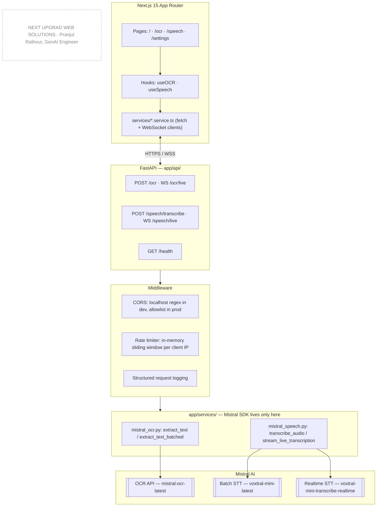

# Mistral AI Workspace — OCR & Speech-to-Text

A production-grade SaaS workspace built on two Mistral AI multimodal
capabilities: **OCR** (image/PDF → structured, searchable text, at
book scale) and **real-time Speech-to-Text** (live microphone
transcription with a post-recording accuracy refinement pass). Built to
feel like something shippable tomorrow, not a weekend demo.

[](https://github.com/Pranjulrathour/OCR-STT-NEXTUPGRAD-mistral.ai-/actions/workflows/ci.yml)
[](LICENSE)
[](frontend)
[](backend)

---

## Table of Contents

1. [What this actually does](#what-this-actually-does)
2. [Why it's built this way](#why-its-built-this-way)
3. [Architecture](#architecture)
4. [Tech stack](#tech-stack)
5. [Repository layout](#repository-layout)
6. [Getting started](#getting-started)
7. [Configuration reference](#configuration-reference)
8. [API reference](#api-reference)
9. [How OCR works](#how-ocr-works)
10. [How Speech-to-Text works](#how-speech-to-text-works)
11. [Testing](#testing)
12. [Docker](#docker)
13. [Security](#security)
14. [Production readiness](#production-readiness)
15. [Troubleshooting](#troubleshooting)
16. [Documentation index](#documentation-index)
17. [Roadmap](#roadmap)
18. [License](#license)

---

## What this actually does

**OCR** — drop in an image or a PDF (a single scanned page or a whole
400-page textbook) and get back clean, structured text: markdown with
headings and tables preserved, a plain-text version, and — for anything
longer than one page — a full **book reader UI** with an auto-generated
table of contents, page-by-page navigation, and search across the entire
document with highlighted matches. Progress streams in live (`Page 45 of
320…`) instead of staring at a spinner for two minutes.

**Speech-to-Text** — click record, talk, watch your words appear on
screen as you say them. Under the hood this is genuinely live streaming
transcription (not a polling hack), with live language detection. The
moment you stop, the full recording is silently re-transcribed with a
more accurate model and the transcript is swapped in — so you get both
low latency while recording and higher accuracy once you're done.

Both features are exposed as a REST endpoint (for programmatic/one-shot
use) **and** a WebSocket endpoint (for the live, progressive UI
experience) — see [API reference](#api-reference).

## Why it's built this way

A few decisions in this codebase exist because of something discovered by
testing against the *real* Mistral API and a *real* browser — not because
it looked good on paper. The two most consequential:

- **OCR is batched by page, not sent as one request.** A single OCR call
  has no way to report progress on a multi-minute job, and eventually hits
  practical size/time ceilings. Documents are split into page batches
  (`OCR_BATCH_PAGES`), each OCR'd independently, with a progress frame
  sent after every batch. This is also why results carry per-page content
  — the book reader UI needs page boundaries to build a table of
  contents. Full writeup: [`docs/features/ocr.md`](docs/features/ocr.md).
- **Speech-to-Text uses two different Mistral models on purpose.** The
  realtime streaming model (`STT_REALTIME_MODEL`) is tuned for latency;
  the batch model (`STT_MODEL`) is more accurate but has no realtime mode.
  Rather than pick one, the app streams live with the fast model, then
  silently re-transcribes the full buffered audio with the accurate model
  the instant you stop. Full writeup:
  [`docs/features/speech.md`](docs/features/speech.md).

Every non-obvious fix in this codebase — why uploads are chunked into
512KB WebSocket frames, why the per-batch OCR timeout scales with page
count, why the realtime audio worklet is versioned with a cache-busting
query string — is documented with the *why*, not just the *what*, in the
two feature docs above and in [`docs/troubleshooting.md`](docs/troubleshooting.md).

## Architecture

Clean, layered architecture — presentation never talks to the Mistral SDK
directly, everything routes through a service layer:



Deeper dives, each with their own diagrams:
[`docs/architecture.md`](docs/architecture.md) ·
[`docs/features/ocr.md`](docs/features/ocr.md) ·
[`docs/features/speech.md`](docs/features/speech.md)

## Tech stack

| Layer | Technology |
|---|---|
| Frontend framework | Next.js 15 (App Router), TypeScript (strict) |
| Frontend styling | Tailwind CSS v4, shadcn/ui ("Nova" preset), Lucide icons, Framer Motion |
| Frontend content | react-markdown + remark-gfm (OCR result rendering) |
| Backend framework | FastAPI (async), Uvicorn |
| Backend validation | Pydantic v2, pydantic-settings |
| Backend utilities | httpx, pypdf (local page counting for OCR batching) |
| AI provider | Mistral AI — `mistral-ocr-latest`, `voxtral-mini-latest`, `voxtral-mini-transcribe-realtime-2602` (via `mistralai` SDK 2.9.1) |
| Code quality | Ruff, Black, mypy (`--strict`), pytest + pytest-asyncio + pytest-cov |
| CI/CD | GitHub Actions — lint, type-check, test, dependency/security scan |
| Containerization | Docker (multi-stage builds, non-root users, healthchecks), Docker Compose |

## Repository layout

```
.
├── backend/                  FastAPI service
│   ├── app/
│   │   ├── api/               Routers: ocr.py, speech.py, health.py
│   │   ├── core/               Settings, rate limiter, Mistral client factory
│   │   ├── middleware/         CORS, structured logging
│   │   ├── schemas/            Pydantic request/response DTOs
│   │   ├── services/           mistral_ocr.py, mistral_speech.py — SDK boundary
│   │   └── utils/               PCM→WAV conversion, file/validator helpers
│   ├── tests/                  40 tests: unit, service, WS integration
│   └── Dockerfile
├── frontend/                  Next.js 15 app
│   ├── app/                    Routes: / , /ocr , /speech , /settings
│   ├── components/              ocr/ (book reader), speech/, settings/, ui/
│   ├── hooks/                    useOCR.ts, useSpeech.ts — client state machines
│   ├── services/                 REST + WebSocket client wrappers
│   ├── public/                   pcm-worklet-processor.js (raw PCM16 capture)
│   └── Dockerfile
├── docs/
│   ├── prd/                    6-part Product Requirements Document
│   ├── adr/                    Architecture Decision Records
│   ├── diagrams/               Mermaid source (.mmd) for every flow
│   ├── features/               OCR & Speech deep-dive docs with diagrams
│   ├── architecture.md         Living architecture document
│   ├── security.md
│   ├── troubleshooting.md
│   └── production-readiness.md Honest ✅/⚠️/❌ checklist, not a marketing page
├── .github/workflows/ci.yml    Lint → type-check → test → security scan
├── docker-compose.yml
└── README.md                   You are here
```

## Getting started

### Prerequisites

- Node.js 22+, Python 3.12+
- A [Mistral AI API key](https://console.mistral.ai/)

### Backend

```bash
cd backend
python -m venv .venv
.venv\Scripts\activate          # Windows; use `source .venv/bin/activate` on macOS/Linux
pip install -e ".[dev]"
copy .env.example .env           # macOS/Linux: cp .env.example .env
# then edit .env and set MISTRAL_API_KEY
uvicorn app.main:app --reload --port 8000
```

Backend is live at `http://localhost:8000` — `/api/v1/health` for a
liveness check, `/docs` for interactive Swagger UI.

### Frontend

```bash
cd frontend
npm install
copy .env.example .env.local     # macOS/Linux: cp .env.example .env.local
npm run dev
```

Frontend is live at `http://localhost:3000`. Open `/ocr` to try OCR (drag
in an image or PDF) or `/speech` to try live transcription (grant
microphone access when prompted).

### What to actually test

- **OCR**: a single image (fast path, ~5–10s) and a multi-page PDF (batched
  path — watch the live "Page X of Y" progress, then use the book reader's
  table of contents, page navigation, and search once it lands).
- **Speech**: start recording, talk, watch words appear live with a
  language badge, then stop and confirm the transcript refines to a
  "Refined" badge a moment later.

## Configuration reference

All settings live in `backend/.env` (see `backend/.env.example` for the
full annotated template).

| Variable | Default | Purpose |
|---|---|---|
| `ENVIRONMENT` | `local` | `local` enables a permissive localhost CORS regex; anything else uses the explicit `CORS_ORIGINS` allowlist |
| `HOST` / `PORT` | `0.0.0.0` / `8000` | Bind address |
| `MISTRAL_API_KEY` | — | **Required.** Your Mistral API key |
| `MISTRAL_BASE_URL` | `https://api.mistral.ai` | Mistral API base URL |
| `OCR_MODEL` | `mistral-ocr-latest` | OCR model |
| `STT_MODEL` | `voxtral-mini-latest` | Batch/file transcription model |
| `STT_REALTIME_MODEL` | `voxtral-mini-transcribe-realtime-2602` | Realtime streaming model — **not interchangeable** with `STT_MODEL` |
| `STT_STREAMING_DELAY_MS` | `250` | Realtime latency/context tradeoff |
| `STT_REFINE_AFTER_STOP` | `true` | Run the post-stop accuracy re-pass |
| `CORS_ORIGINS` | `http://localhost:3000` | Comma-separated allowlist (non-local environments) |
| `MAX_UPLOAD_SIZE_MB` | `100` | Hard cap on OCR upload size |
| `OCR_TIMEOUT_SECONDS` | `30` | Timeout for the single-shot OCR path |
| `OCR_BATCH_PAGES` | `20` | Pages per Mistral call when batching |
| `OCR_MAX_PAGES` | `1500` | Hard cap on total pages per document |
| `OCR_SECONDS_PER_PAGE` | `15` | Per-batch timeout budget, scaled by batch size |
| `OCR_BATCH_TIMEOUT_FLOOR_SECONDS` | `60` | Minimum per-batch timeout regardless of batch size |
| `OCR_BATCH_CONCURRENCY` | `4` | Batches OCR'd concurrently rather than one-at-a-time — cuts wall-clock time roughly N-fold for multi-hundred-page documents |
| `SPEECH_TIMEOUT_SECONDS` | `60` | Timeout for the single-shot transcription path |
| `RATE_LIMIT_REQUESTS_PER_MINUTE` | `10` | Per-client-IP cap — every request proxies to a paid Mistral call |

## API reference

| Method & Path | Purpose |
|---|---|
| `GET /api/v1/health` | Liveness check |
| `POST /api/v1/ocr` | Single-shot OCR — synchronous, for quick images/short docs or programmatic callers that don't need progress |
| `WS /api/v1/ocr/live` | Progressive OCR — chunked upload, live `{total_pages}` → `{pages_done,total_pages}` → `{result}` frames, book-scale documents |
| `POST /api/v1/speech/transcribe` | Single-shot file transcription |
| `WS /api/v1/speech/live` | Live microphone transcription — streams `{chunk}`/`{language}` while recording, then `{status:"refining"}` → `{refined_transcript}` after stop |

Full request/response shapes: interactive Swagger UI at `/docs` when the
backend is running, or the protocol tables in
[`docs/features/ocr.md`](docs/features/ocr.md#contract) and
[`docs/features/speech.md`](docs/features/speech.md#contract).

## How OCR works

Full pipeline, sequence diagram, and frontend state machine:
**[`docs/features/ocr.md`](docs/features/ocr.md)**.

In short: the file is uploaded to the backend in 512KB WebSocket chunks
(discovered necessary after a real 40MB PDF silently broke the connection
against uvicorn's default frame-size limit). PDFs have their page count
read locally via `pypdf` — no network call — then get split into batches
of `OCR_BATCH_PAGES`, each batch OCR'd by Mistral independently with a
progress frame sent back after every batch. Images take a single-batch
fast path. The final result carries both the whole joined document and a
per-page breakdown, which is what the book reader UI (table of contents,
page navigation, cross-document search) is built from.

## How Speech-to-Text works

Full pipeline, sequence diagram, and connection-state diagram:
**[`docs/features/speech.md`](docs/features/speech.md)**.

In short: the browser captures microphone audio via the Web Audio API and
a custom `AudioWorklet` that converts it to raw 16-bit PCM at 16kHz — the
exact format Mistral's realtime endpoint requires (a `MediaRecorder`'s
default compressed output will not work). Audio streams to the backend
over a WebSocket, which forwards it to Mistral's realtime transcription
API and relays text/language deltas back as they arrive. The moment
recording stops, the backend re-transcribes the full buffered audio with
the more accurate batch model and swaps in the refined result.

## Testing

```bash
# Backend — 40 tests, 87% coverage (services/ at 89–94%)
cd backend
pytest --cov=app --cov-report=term-missing
ruff check .
mypy app --strict

# Frontend
cd frontend
npx tsc --noEmit
npx eslint .
npm run build
```

Backend tests cover: chunking math, markdown-to-plain-text conversion,
OCR/Speech services against a mocked Mistral client (duck-typed fakes and
real Mistral pydantic model instances where the code does `isinstance()`
checks), the rate limiter, and full WebSocket integration tests for both
`/ocr/live` and `/speech/live`. See
[`docs/production-readiness.md`](docs/production-readiness.md) for an
honest, unpadded breakdown of what is and isn't covered — including the
gaps (no frontend automated tests yet, Docker builds reviewed but not yet
run in every environment).

## Docker

```bash
docker compose up --build
```

Builds and runs both services (`backend` on `:8000`, `frontend` on
`:3000`). Both Dockerfiles use multi-stage builds, run as a non-root user,
and expose a `HEALTHCHECK`. Set `MISTRAL_API_KEY` in your shell (or an
untracked `.env` next to `docker-compose.yml`) before running — see
[`docker-compose.yml`](docker-compose.yml) for the full list of
overridable settings.

## Security

- Secrets live in `.env` files (gitignored); `.env.example` templates are
  checked in with placeholder values only.
- Every upload is validated (type, size) before any Mistral API call.
- Per-client-IP rate limiting on all four Mistral-proxying endpoints — an
  in-memory sliding window, since every request costs a real API call.
- `pip-audit` and `npm audit` run in CI on every push and pull request.
- No auth, no accounts, no database — intentionally: see
  [Explicit non-goals](docs/prd/01-foundation.md#non-goals). This is a
  single-operator tool, not a multi-tenant service.

Full threat-model notes: [`docs/security.md`](docs/security.md).

## Production readiness

[`docs/production-readiness.md`](docs/production-readiness.md) is a
deliberately honest ✅/⚠️/❌ checklist — it says plainly where things stand
unverified (Docker builds were reviewed but not run to completion in the
build environment) rather than claiming a clean sweep. Read it before
deploying.

## Troubleshooting

Common failure modes and their actual root causes (CORS misconfiguration
masquerading as "connection lost", a stale cached AudioWorklet silently
dropping all outbound audio, WebSocket frame-size limits breaking large
uploads) are written up with the real fix in
[`docs/troubleshooting.md`](docs/troubleshooting.md).

## Documentation index

| Document | Contents |
|---|---|
| [`docs/prd/00-index.md`](docs/prd/00-index.md) | Product Requirements Document (6 parts) |
| [`docs/adr/`](docs/adr/) | Architecture Decision Records |
| [`docs/architecture.md`](docs/architecture.md) | Living architecture document |
| [`docs/features/ocr.md`](docs/features/ocr.md) | OCR deep dive, diagrams, live-API verification |
| [`docs/features/speech.md`](docs/features/speech.md) | Speech-to-Text deep dive, diagrams, live-API verification |
| [`docs/security.md`](docs/security.md) | Threat model and mitigations |
| [`docs/troubleshooting.md`](docs/troubleshooting.md) | Real bugs found, real root causes, real fixes |
| [`docs/production-readiness.md`](docs/production-readiness.md) | Honest go/no-go checklist |
| [`docs/deployment.md`](docs/deployment.md) | Free-tier hosting options and step-by-step deploy instructions |

## Roadmap

- Frontend automated test suite (component + hook tests) — currently
  verified manually through the real UI, which is real evidence but not a
  repeatable regression net.
- Load testing the in-memory rate limiter under real concurrency.
- A CI job that actually builds the Docker images (currently a manual
  step; blocked in the primary build environment by a local Docker daemon
  issue, not a code problem).
- OCR job cancellation (currently: closing the socket stops the job, but
  there's no explicit "Cancel" affordance in the UI).

## License

[MIT](LICENSE) © 2026 Pranjul Rathour

---
**Author:** Pranjul Rathour
**Designation:** GenAI Engineer
**Organization:** NEXT UPGRAD WEB SOLUTIONS


## Document RAG Chatbot

The workspace now includes a document-grounded RAG pipeline. OCR output is automatically
chunked and embedded with Mistral `mistral-embed`, stored in a persistent FAISS vector
index, and retrieved by the document assistant. The assistant uses Mistral chat to answer
only from retrieved document context and returns filename/page sources when available.

RAG settings are available in `backend/.env.example`. In Docker, `./backend/data` is
mounted so the FAISS index survives container restarts.
