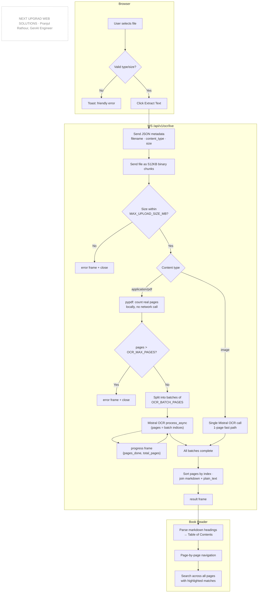
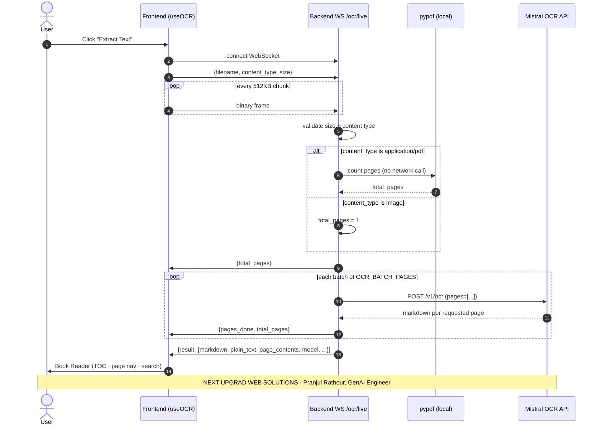
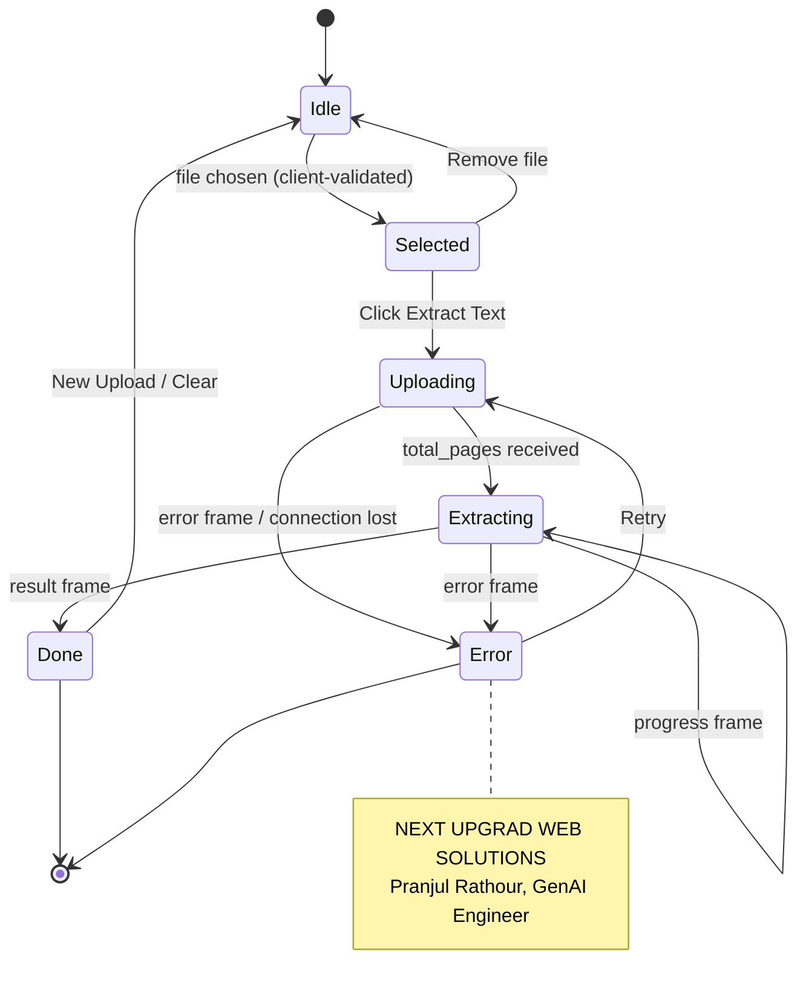

# Feature: OCR (Image & Book-Scale PDF Text Extraction)

Extracts text from images and PDFs — from a single scanned page up to a
full book — using Mistral's OCR API, with live page-by-page progress and a
book-reader UI (table of contents, page navigation, cross-document search)
for multi-page results.

## Why it's built this way

A single Mistral OCR call is fine for one page. It is not fine for a
400-page scanned textbook: there's no way to show real progress on an
opaque multi-minute call, and a single request eventually hits practical
size/time ceilings. So book-scale documents are split into page batches,
each OCR'd as its own Mistral call, with a progress message sent back to
the browser after every batch. This is also *why* the result carries
per-page content (`page_contents`), not just one joined blob — the frontend
needs page boundaries to build a table of contents and page navigation.

## Pipeline

*(source: [`docs/diagrams/ocr-pipeline-flowchart.mmd`](../diagrams/ocr-pipeline-flowchart.mmd))*

## Protocol timeline

*(source: [`docs/diagrams/ocr-live-sequence.mmd`](../diagrams/ocr-live-sequence.mmd))*

## Frontend state machine

*(source: [`docs/diagrams/ocr-extraction-state.mmd`](../diagrams/ocr-extraction-state.mmd))*

## Why the upload is chunked, not sent as one frame

Found by testing with a real 40MB scanned book, not a synthetic file:
sending the whole file as one WebSocket frame hit uvicorn's default 16MB
`ws_max_size` and silently broke the connection — no exception the caller
could act on, just a dead upload. Rather than depend on every deployment
(dev, Docker, staging, production) remembering to raise that server flag
identically, the file goes over the wire as many 512KB frames
(`UPLOAD_CHUNK_BYTES` in both `frontend/hooks/useOCR.ts` and
`backend/app/api/ocr.py` — keep them in sync if you change either). Upload
capacity is then governed only by `MAX_UPLOAD_SIZE_MB`, never by a
transport-layer default.

## Why the per-batch timeout scales with batch size

The single-image path (`POST /api/v1/ocr`) uses `OCR_TIMEOUT_SECONDS` (30s)
— fine for one quick call. The batched path does not reuse that number: 20
image-heavy scanned pages legitimately need minutes, not 30 seconds. Found
the same way — the first live test against a real textbook chapter timed
out on batch one. Fixed with `Settings.ocr_batch_timeout_seconds(page_count)`
= `max(OCR_BATCH_TIMEOUT_FLOOR_SECONDS, OCR_SECONDS_PER_PAGE × page_count)`.

## Why batches are sliced into their own small PDF, not re-sent whole

Found in production, not in testing: Mistral's `pages` parameter only
*selects* which pages of an uploaded document to OCR — it still requires
the entire document body on every call. The original implementation kept
one base64-encoded copy of the whole file and reused it across every
batch, meaning a 79MB/277-page real book was re-uploaded in full on all 14
batch calls (~1.5GB of repeated uploads for one document). That's what
crashed the deployed backend on batch 2 — confirmed by calling Mistral
directly with the exact same batch, which succeeded fine outside the
memory-constrained container, proving the content itself was never the
problem. Each batch now slices only its own pages into a fresh, small PDF
(via `pypdf.PdfWriter`) before encoding — a few MB instead of ~100MB per
call.

## Why batches run concurrently instead of one at a time

Each Mistral OCR call is I/O-bound, so running several at once (bounded by
`OCR_BATCH_CONCURRENCY`, default 4) cuts wall-clock time roughly N-fold
instead of queuing every batch strictly one after another. Progress events
now fire as soon as *any* batch completes — not in guaranteed page order,
but the final result is always re-sorted by page index before assembly,
so out-of-order completion never affects correctness. A real 277-page/79MB
book OCR'd end-to-end in ~63 seconds at the default concurrency of 4.

## Contract

| Endpoint | Purpose |
|---|---|
| `POST /api/v1/ocr` | Single-shot, synchronous. For quick images/short docs and programmatic API consumers that don't need progress. |
| `WS /api/v1/ocr/live` | Progressive, UI-facing. Client → server: `{filename, content_type, size}` then binary chunks. Server → client: `{total_pages}` → repeated `{pages_done, total_pages, completed_pages}` → `{result}` or `{error}`. `completed_pages` is a full snapshot of 0-based page indices done so far (not a delta) — the frontend's page-status grid renders directly off it. |

`result` (`OcrSuccessResponse`): `filename`, `pages` (count), `markdown` /
`plain_text` (whole document, joined), `page_contents` (list of
`{index, markdown, plain_text}` — what the Book Reader is built from),
`model`, `processing_time`.

## Configuration (`backend/.env`)

| Setting | Default | Meaning |
|---|---|---|
| `MAX_UPLOAD_SIZE_MB` | 100 | Hard cap on upload size (both endpoints) |
| `OCR_BATCH_PAGES` | 20 | Pages per Mistral call when batching |
| `OCR_MAX_PAGES` | 1500 | Hard cap on total pages, rejected before any Mistral call |
| `OCR_SECONDS_PER_PAGE` | 15 | Per-batch timeout budget, multiplied by batch size |
| `OCR_BATCH_TIMEOUT_FLOOR_SECONDS` | 60 | Minimum per-batch timeout regardless of batch size |
| `OCR_BATCH_CONCURRENCY` | 4 | Batches OCR'd concurrently rather than sequentially |
| `RATE_LIMIT_REQUESTS_PER_MINUTE` | 10 | Per-IP cap — every call proxies to a paid Mistral request |

## Edge cases handled

- Empty file, oversized file, unsupported type → rejected before any
  Mistral call, with a friendly message (never a raw error).
- Password-protected / corrupted PDF → `pypdf` raises, converted to
  "Unable to read this PDF. It may be corrupted or password protected."
- No text detected on a page/document → "No text detected in this
  document." rather than a silently empty result.
- Client disconnects mid-upload → server notices on the next `receive()`
  and stops, no dangling Mistral calls.

## Verified against the live API (not just unit tests)

- Synthetic 5-page PDF at `OCR_BATCH_PAGES=2` (3 batches): progress arrived
  in order, pages reassembled in the correct index order across batch
  boundaries.
- **Real 42-page, 40MB scanned biology textbook chapter**, driven through
  the actual browser UI end-to-end: full extraction in ~60 seconds, correct
  table of contents, working page navigation, and cross-book search
  returning accurate per-page match counts. This run is what surfaced both
  the chunked-upload fix and the per-batch-timeout fix above.
- **Real 277-page, 79MB MCA textbook**, run directly against the deployed
  production backend over its live WebSocket. First attempt crashed on
  batch 2 with the full-document-resend bug described above. After the
  fix (per-batch slicing + concurrent batches), the same book completed
  end-to-end in ~63 seconds with all 277 pages correctly ordered, no
  duplicates, and no gaps.

---
**Author:** Pranjul Rathour
**Designation:** GenAI Engineer
**Organization:** NEXT UPGRAD WEB SOLUTIONS
