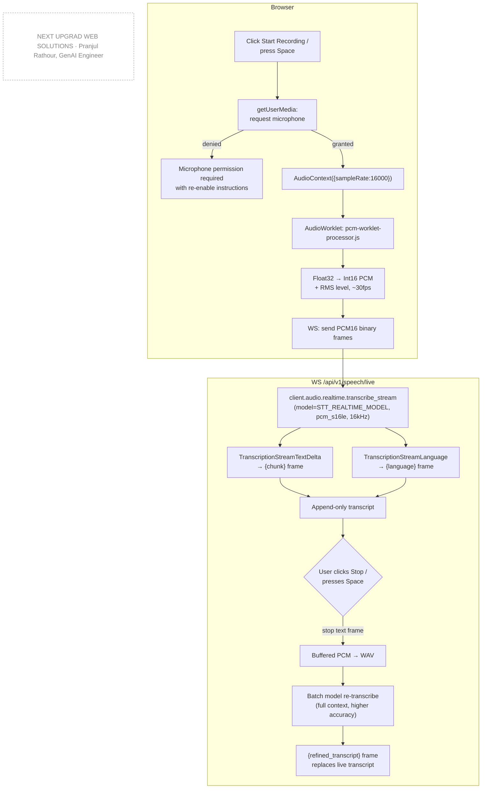
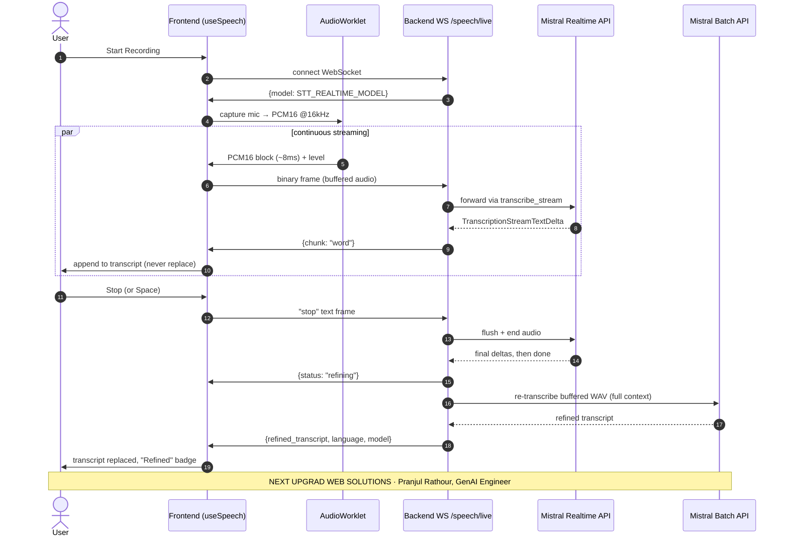
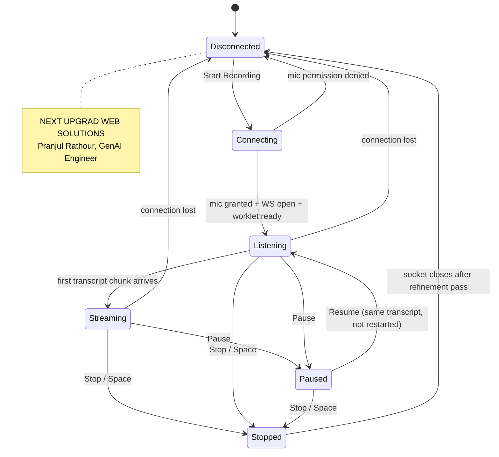

# Feature: Real-Time Speech-to-Text

Live, word-by-word transcription from the microphone using Mistral's
realtime Voxtral API, with a live language badge, a real audio-level
meter, and an automatic higher-accuracy re-pass once recording stops.

## Why it's built this way

Two things had to be true for this to feel "live": genuine incremental
transcription (not periodic re-transcription of a growing buffer — that
was the fallback plan until testing showed Mistral actually exposes true
realtime streaming), and audio in the exact format that API requires (raw
`pcm_s16le` at 16kHz — `MediaRecorder`'s default webm/opus output will not
work here, which is why capture goes through the Web Audio API and a
custom `AudioWorklet` instead).

The realtime model is tuned for low latency, which trades away some of the
accuracy a full-context batch pass doesn't have to sacrifice. Rather than
force a choice between "fast" and "accurate," the app gets both: live
streaming while recording, then one silent re-transcription of the full
buffered audio with the batch model right after Stop, swapping in the more
accurate result.

## Pipeline

*(source: [`docs/diagrams/speech-pipeline-flowchart.mmd`](../diagrams/speech-pipeline-flowchart.mmd))*

## Protocol timeline

*(source: [`docs/diagrams/speech-live-sequence.mmd`](../diagrams/speech-live-sequence.mmd))*

## Connection states

*(source: [`docs/diagrams/speech-connection-state.mmd`](../diagrams/speech-connection-state.mmd))*

## Two things only discovered by testing against the live API

- **The realtime endpoint needs its own model id.** Using the batch model
  (`voxtral-mini-latest`) for the realtime call gets an HTTP 403 with no
  explanatory body — there was no way to tell "wrong model" from "no beta
  access" without checking Mistral's own docs. The correct id is
  `voxtral-mini-transcribe-realtime-2602` (`STT_REALTIME_MODEL`), kept
  entirely separate from the batch model setting (`STT_MODEL`).
- **The realtime API only accepts raw PCM, not a compressed container.**
  `MediaRecorder`'s default webm/opus output silently fails here — capture
  goes through `AudioContext` + a custom `AudioWorklet`
  (`frontend/public/pcm-worklet-processor.js`) that converts Float32 audio
  samples to 16-bit PCM in the audio thread and posts them to the main
  thread for sending.

## Why the browser tab caching the old worklet script broke recording silently

When the worklet's message format changed (adding the audio-level meter),
a browser that had the *old* worklet script cached kept posting
`ArrayBuffer`s directly instead of `{type: "audio", buffer}` objects. The
new handler checked `message.type`, got `undefined` on the stale format,
matched neither branch, and silently never called `socket.send()` — no
error, just a recording that listens forever and transcribes nothing. Fixed
with a version query string on the worklet module URL
(`PCM_WORKLET_VERSION` in `useSpeech.ts`) so a stale cached copy can never
be served under the same URL again.

## Contract

| Endpoint | Purpose |
|---|---|
| `POST /api/v1/speech/transcribe` | File-based fallback transcription (batch model). |
| `WS /api/v1/speech/live` | Realtime streaming. Server → client frames: `{model}` once on connect, `{chunk}` per text delta, `{language}` when detected, `{error}`, and after a clean stop: `{status:"refining"}` then `{refined_transcript, language, model}`. Client → server: binary PCM16 frames while recording, one `"stop"` text frame to finish. |

## Configuration (`backend/.env`)

| Setting | Default | Meaning |
|---|---|---|
| `STT_MODEL` | `voxtral-mini-latest` | Batch/file transcription model |
| `STT_REALTIME_MODEL` | `voxtral-mini-transcribe-realtime-2602` | Realtime streaming model — **not interchangeable** with the above |
| `STT_STREAMING_DELAY_MS` | 250 | Lower = words surface sooner, less context per word |
| `STT_REFINE_AFTER_STOP` | true | Run the post-stop accuracy re-pass |
| `RATE_LIMIT_REQUESTS_PER_MINUTE` | 10 | Per-IP cap, shared budget with OCR endpoints under the `speech:` key prefix |

## Edge cases handled

- Microphone permission denied → explanatory message with re-enable
  instructions, not a silent failure.
- Pause/Resume keeps the same transcript session — resuming does not start
  a new one.
- Tab loses focus or network drops mid-recording → connection-state badge
  reflects it; the audio pipeline tears down cleanly (`teardownAudio`)
  regardless of how the session ended.
- Refinement pass failing (rare) never destroys the live transcript — it's
  caught and swallowed; the user keeps what streaming already produced.

## Verified against the live API (not just unit tests)

Windows SAPI text-to-speech → 16kHz PCM WAV → both endpoints, transcript
matched the spoken sentence exactly both ways. Then a full WebSocket
integration test replaying the same audio in real AudioWorklet-sized
128-sample chunks confirmed streaming chunks arrive in order, followed by
the refined pass. Final confirmation was a real microphone session through
the actual browser UI: live word-by-word transcript, correct model badge,
and an accurate refined result after Stop.

---
**Author:** Pranjul Rathour
**Designation:** GenAI Engineer
**Organization:** NEXT UPGRAD WEB SOLUTIONS
